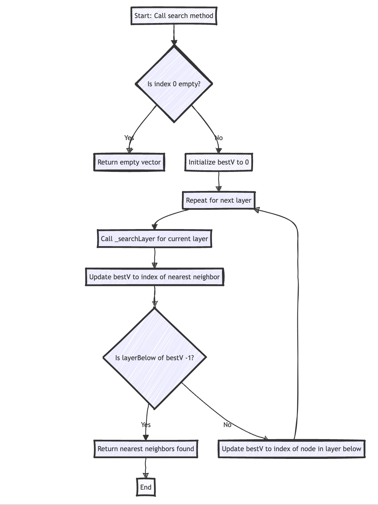

# simple-vectordb-cpp :: an experimental Vector store embedding search.

This project is inspired by [client-vector-search](https://github.com/yusufhilmi/client-vector-search).


Search Implementaion:




### Build

#### Compile

```g++ -std=c++17 main.cpp -o ./main -I ./json/single_include/nlohmann```

#### Compile for Web Assembly using Emscripten

``` emcc -std=c++17 main.cpp -o ./index.html -I ./json/single_include/nlohmann ```